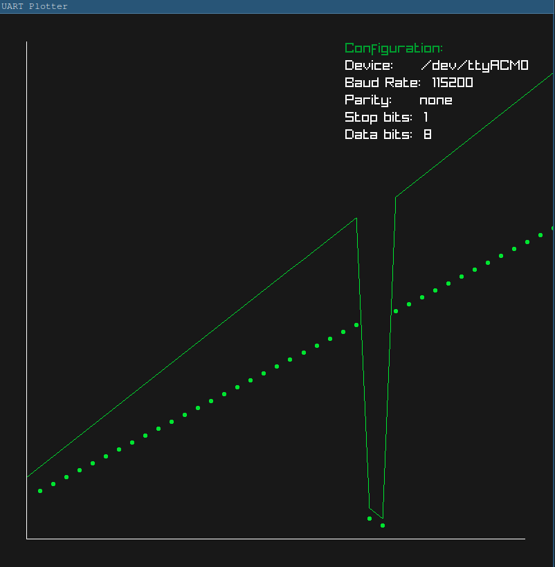

# UART Serial Plotter
 

A simple UART serial plotter application using **raylib** to visualize data received from a UART device. This tool allows you to plot values from a UART-enabled device.

## Requirements
- **gcc**: C compiler for building the project.
- **raylib**: Graphics library for visualization.
- **xhost**: (Optional) Required to allow GUI apps to run with root privileges on Hyprland.

## Building the Application

1. Clone the repository:
    ```bash
    git clone https://github.com/high-haseeb/uart-plotter.git
    cd uart-plotter
    ```

2. Install dependencies:
    - Install **raylib**:
      - On Ubuntu: `sudo apt-get install libraylib-dev`
      - On Arch Linux: `sudo pacman -S raylib`

3. Build the application:
    ```bash
    make
    ```

## License
This project is licensed under the MIT License - see the [LICENSE](LICENSE) file for details.

Copyright (C) 2024  High Haseeb
